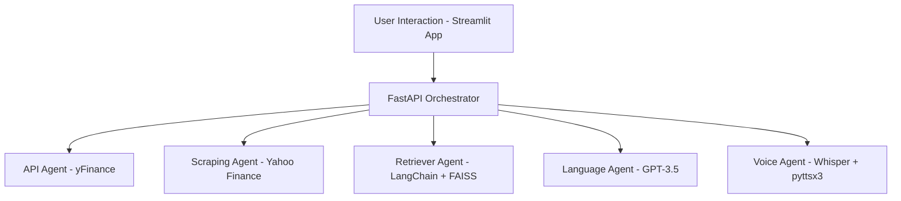

# 🧠 Multi-Agent Finance Assistant

## 🚀 Project Objective
To deliver a **real-time, voice-interactive market briefing system** using modular AI agents that extract, analyze, summarize, and vocalize key financial data for informed decision-making.

## 📙 What This System Delivers
* 📈 **Latest Stock Movements** for leading Asia tech companies (TSMC, Samsung)
* 📒 **Earnings Reports Scraping** from Yahoo Finance
* 📚 **Semantic Retrieval** from financial news documents
* 📝 **Natural Language Summary Generation** (via OpenAI GPT)
* 🎧 **Voice Interface**: Speak-to-Text and Text-to-Speech for hands-free interaction
* 💻 **Streamlit Dashboard** to interact with the system via UI

## 🧠 Architecture Overview



## 🧱 Modular Code Structure

```
multi_agent_finance_assistant/
├── agents/
│   ├── api_agent.py         # Fetch stock data
│   ├── scraping_agent.py    # Scrape earnings data
│   ├── retriever_agent.py   # Semantic info retriever
│   ├── analysis_agent.py    # Simple risk analysis logic
│   ├── language_agent.py    # Summarization via GPT
│   └── voice_agent.py       # STT and TTS using Whisper & pyttsx3
├── data_ingestion/
│   ├── market_api_loader.py # Loads live market data
│   └── filing_scraper.py    # Scrapes financial filings
├── orchestrator/
│   └── orchestrator.py      # FastAPI app orchestrating agents
├── streamlit_app/
│   └── app.py               # Streamlit dashboard
├── docs/
│   └── ai_tool_usage.md     # Logs for prompt engineering and tool use
├── Dockerfile
├── requirements.txt
└── README.md
```

## ⚙️ Setup & Deployment

1. Clone the repository
```bash
git clone https://github.com/srinathstart/Finance-Assistant.git
cd Finance-Assistant
```

2. Create virtual environment & install dependencies
```bash
python -m venv venv
source venv/bin/activate  # or venv\Scripts\activate on Windows
pip install -r requirements.txt
```

3. Run Backend API Server (FastAPI)
```bash
uvicorn orchestrator.orchestrator:app --reload
```

4. Run the Streamlit Dashboard
```bash
streamlit run streamlit_app/app.py
```

## 🧰 Key Technologies Used

| Component | Tool/Library |
|-----------|--------------|
| Market Data API | `yfinance` |
| Web Scraping | `BeautifulSoup`, `requests` |
| Language Model | `OpenAI GPT-3.5` |
| Retriever Engine | `LangChain`, `FAISS` |
| Voice Interface | `OpenAI Whisper`, `pyttsx3` |
| Backend Server | `FastAPI` |
| Dashboard UI | `Streamlit` |
| Packaging | `Docker` |

## 📄 Documentation
All prompt logs, tool usage patterns, and model interaction details are available in:
```
docs/ai_tool_usage.md
```

## ✨ Future Enhancements
* ✅ Add support for more market indices (US, EU)
* ⏳ Integrate real-time news RSS feeds
* 🔐 Add user authentication and personalization
* 🎤 Voice chatbot interface for full hands-free use


